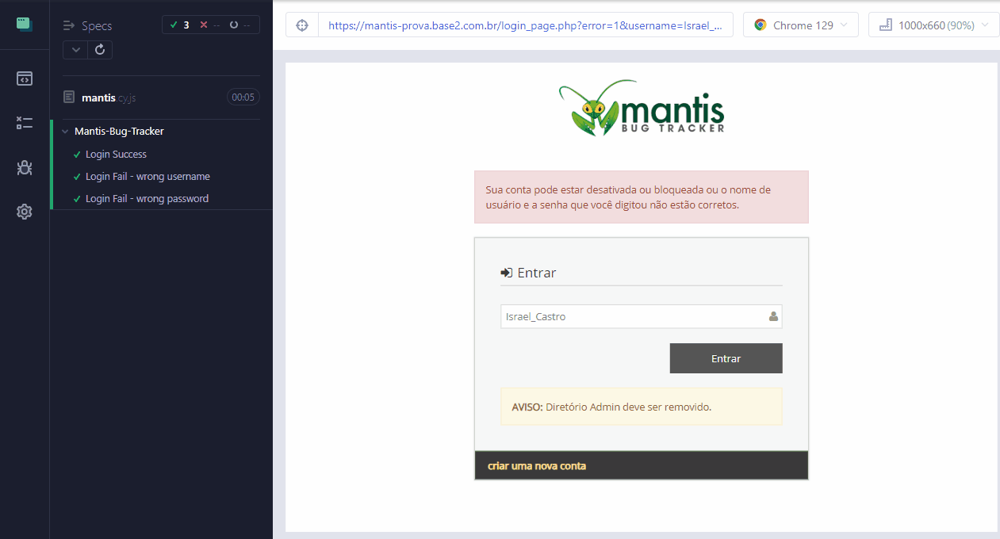

# Minha Automação Cypress 💻

Este projeto utiliza o Cypress para automatizar o teste de um recurso de login. O Cypress é uma estrutura de teste de ponta a ponta baseada em JavaScript que permite que os desenvolvedores escrevam testes e os executem em um navegador real.

[]

## Instalação:
```bash
npm install
```
> **Observação:**
>
> É necessário ter o **node** instalado

## Execução:
```bash
# Você abre a interface do usuário do Cypress
npx cypress open

# Executa a automação pela linha de comando
npx cypress run
```